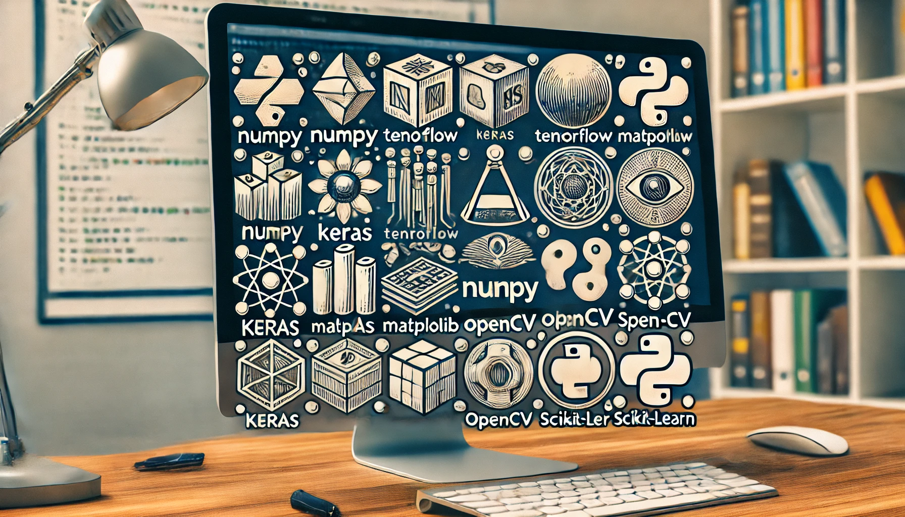
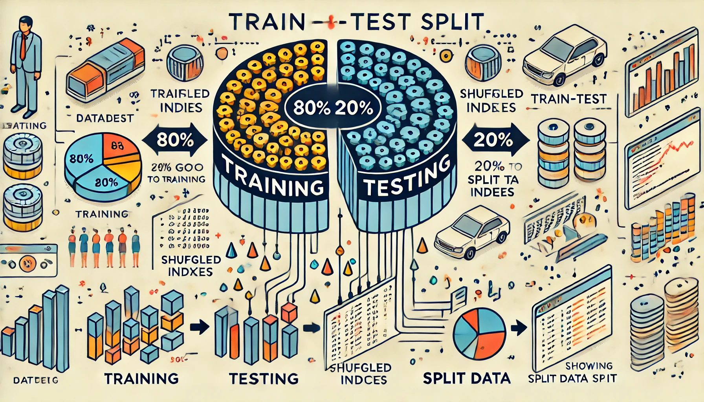
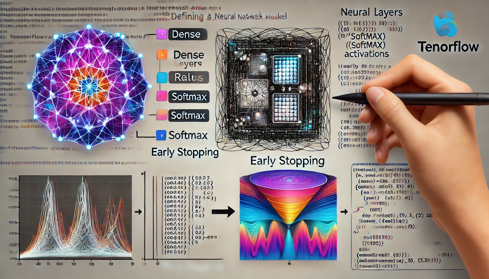
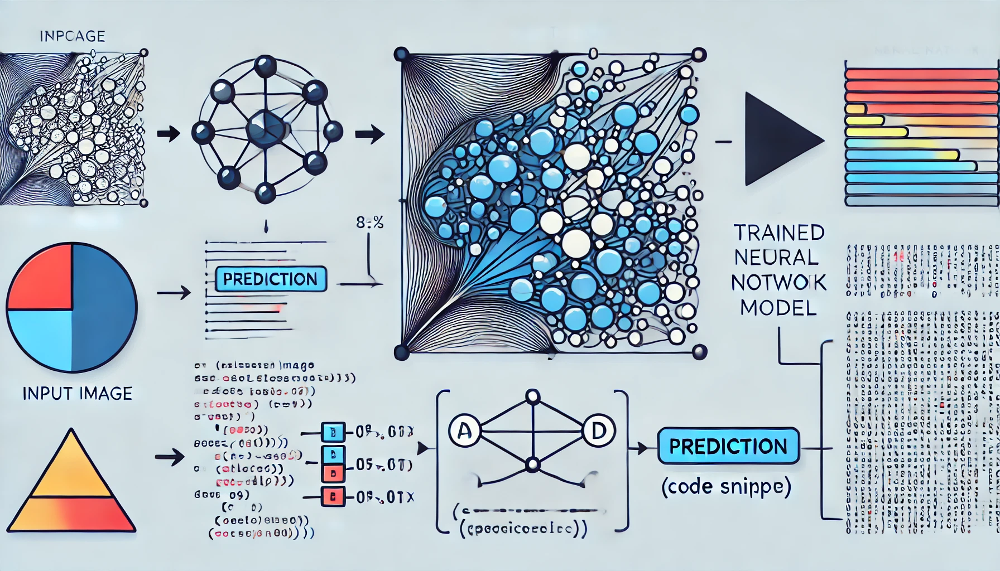
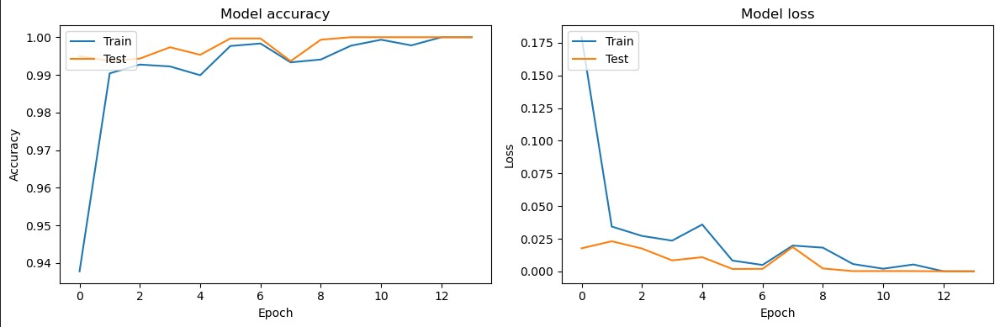

# Shape Recognition

<div style="text-align: center;">
    
</div>


Welcome to the Shape Recognition repository! This project demonstrates a machine learning workflow for recognizing geometric shapes (triangle, star, square, circle) using neural networks implemented with TensorFlow and Keras.

## Table of Contents

- [Introduction](#introduction)
- [Dataset](#dataset)
- [Installation](#installation)
- [Usage](#usage)
- [Model Architecture](#model-architecture)
- [Results](#results)
- [Contributing](#contributing)
- [License](#license)

## Introduction

This project aims to classify geometric shapes from images. The neural network model is trained to recognize four different shapes: triangles, stars, squares, and circles. The project covers the entire machine learning pipeline, from data preprocessing to model evaluation and prediction.

## Dataset

The dataset consists of images of geometric shapes stored in folders named after the shapes. Each image is resized to 60x60 pixels and converted to grayscale for processing.

## Installation

To get started, clone the repository and install the required libraries:

```bash
git clone https://github.com/HoomKH/Shape_Recognition.git
cd Shape_Recognition
pip install -r requirements.txt
```

## Usage

Follow these steps to run the project:

1. **Import Libraries**

    <div style="text-align: center;">
        
    </div>

    Import all the necessary libraries for the project.

2. **Load and Process the Dataset**

    <div style="text-align: center;">
        
    </div>

    Load images from the dataset, resize them, and label them according to their folder names.

3. **Flatten Data**

    <div style="text-align: center;">
        
    </div>

    Convert the images into flattened vectors for model input.

4. **Split to Train and Test**

    <div style="text-align: center;">
        
    </div>

    Split the dataset into training and testing sets (80% train, 20% test).

5. **Define and Train the Model**

    <div style="text-align: center;">
        
    </div>
    
    Build and train a neural network model using TensorFlow and Keras.

6. **Plot Training & Validation Accuracy and Loss**

    <div style="text-align: center;">
        
    </div>

    Plot the training and validation accuracy and loss over epochs to visualize the model's performance.

7. **Prediction**

    <div style="text-align: center;">
        
    </div>

    Use the trained model to make predictions on new images and evaluate the results.

## Model Architecture

The model is a Sequential neural network with the following layers:
- Dense layer with 128 units and ReLU activation
- Dropout layer with 20% dropout rate
- Dense layer with 64 units and ReLU activation
- Dense layer with 32 units and ReLU activation
- Output Dense layer with 4 units and softmax activation

## Results

<div style="text-align: center;">
    
</div>

The model is evaluated using accuracy and loss metrics. Training and validation accuracy and loss are plotted to assess the performance of the model. Predictions on new images are demonstrated to verify the model's accuracy.

## Contributing

Contributions are welcome! Please feel free to submit a Pull Request.

## License

This project is licensed under the MIT License. See the [LICENSE](LICENSE) file for details.

---

